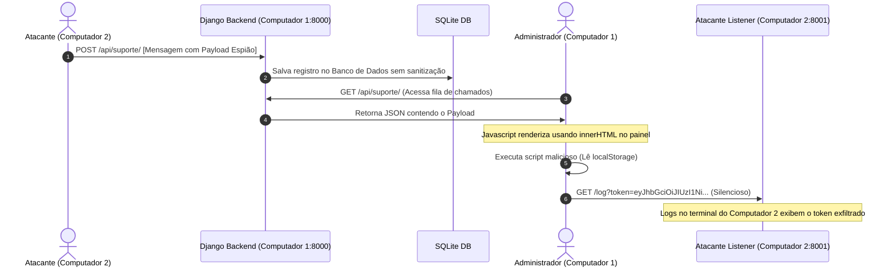

# Fundamentação Teórica e Arquitetura de Segurança: Vulnerabilidades Cross-Site Scripting (XSS)

Este documento apresenta a fundamentação teórica completa, a modelagem de ameaças e a análise arquitetural das vulnerabilidades de **Cross-Site Scripting (XSS)** no contexto do projeto **Autopeças JB**. O objetivo é servir como base acadêmica e técnica rigorosa para o estudo e a apresentação do projeto.

---

## 1. Fundamentos Teóricos e Categorização de XSS

O **Cross-Site Scripting (XSS)** é uma vulnerabilidade de injeção de código que ocorre quando uma aplicação web inclui dados fornecidos pelo usuário em uma página enviada ao navegador sem a devida validação ou sanitização (*escaping*). Isso permite que um atacante execute scripts arbitrários (geralmente JavaScript) no contexto da sessão do navegador da vítima.

No cenário profissional de Segurança da Informação, o XSS é classificado em três variantes fundamentais baseadas no fluxo de dados (*data flow*) e no ponto onde a carga útil (*payload*) é interpretada.

### A. Stored XSS (XSS Armazenado ou Persistente)
O **Stored XSS** ocorre quando o *payload* enviado pelo atacante é gravado de forma permanente no servidor de armazenamento da aplicação (como bancos de dados, arquivos de log ou sistemas de arquivos). 
* **Fluxo de Dados:** O script malicioso é persistido no servidor. Quando qualquer usuário legítimo requisita a página que exibe esse registro, o servidor lê o dado infectado e o envia na resposta HTTP. O navegador da vítima executa o script sob os privilégios da sessão ativa do usuário.
* **Gravidade:** Alta/Crítica. Afeta múltiplos usuários e não exige que a vítima clique em links adulterados específicos; basta acessar a página legítima da aplicação.

### B. Reflected XSS (XSS Refletido ou Não Persistente)
O **Reflected XSS** ocorre quando o *payload* é enviado como parte de uma requisição HTTP da vítima ao servidor (geralmente via parâmetros de consulta em URLs ou dados de formulário), sendo imediatamente "refletido" de volta na página de resposta HTTP sem persistência no banco de dados.
* **Fluxo de Dados:** O script malicioso passa pelo servidor e é retornado de imediato no corpo do HTML.
* **Vetor de Ataque:** O atacante precisa induzir a vítima a interagir com um link construído especificamente para o ataque (através de campanhas de *phishing* ou engenharia social).

### C. DOM-Based XSS (XSS Baseado no DOM)
O **DOM-Based XSS** ocorre quando a vulnerabilidade reside inteiramente no código JavaScript executado no lado do cliente (*client-side*).
* **Fluxo de Dados:** A aplicação lê dados de uma fonte controlada pelo usuário no DOM (conhecida como *Source*, como `location.hash` ou `document.referrer`) e os passa de forma insegura para um método ou propriedade de execução (conhecido como *Sink*, como `.innerHTML` ou `eval()`).
* **Envolvimento do Servidor:** O *payload* pode nunca chegar ao servidor backend. Por exemplo, fragmentos de URL após o caractere `#` não são transmitidos pelo navegador nas requisições HTTP, tornando o ataque puramente local no cliente.

---

## 2. Comparações Arquiteturais e Fluxo de Dados

Abaixo, descrevemos as diferenças arquiteturais operacionais de cada tipo de XSS de forma estruturada:

* **Stored XSS (Armazenado):**
  * **Persistência:** Sim. É gravado de forma permanente no servidor (banco de dados SQLite, arquivos de logs, etc.).
  * **Origem do Payload:** Banco de dados ou arquivos de logs servidos pelo backend.
  * **Ponto de Falha (Sink):** Backend que serve o dado inseguro e código JavaScript do Frontend que o renderiza de forma inadequada.
  * **Tráfego no Servidor:** Sim. O script malicioso trafega nas requisições HTTP de gravação (POST/PUT) e nas de leitura (GET).
  * **Detecção por WAF:** Alta eficácia na análise da requisição de entrada original ou do payload em trânsito.
* **Reflected XSS (Refletido):**
  * **Persistência:** Não. O script é apenas ecoado temporariamente na resposta daquela requisição.
  * **Origem do Payload:** Parâmetros da própria requisição HTTP enviada pela vítima (ex: query strings).
  * **Ponto de Falha (Sink):** Backend que devolve a entrada do usuário sem sanitização e Frontend que a renderiza diretamente.
  * **Tráfego no Servidor:** Sim. O payload trafega nos parâmetros de consulta ou corpo da requisição e no corpo da resposta.
  * **Detecção por WAF:** Alta eficácia, pois o payload está contido explicitamente nas requisições HTTP e nas respostas interceptáveis.
* **DOM-Based XSS (Baseado no DOM):**
  * **Persistência:** Não. Reside estritamente no estado do DOM do navegador cliente.
  * **Origem do Payload:** Fontes locais do DOM gerenciadas pelo browser (ex: `window.location.hash`, referrers).
  * **Ponto de Falha (Sink):** Código JavaScript local executado no cliente (*client-side*) que atualiza elementos dinâmicos do DOM de forma insegura.
  * **Tráfego no Servidor:** Não necessariamente. Em injeções de rota após o `#` (URL fragment), os dados nunca são enviados ao servidor.
  * **Detecção por WAF:** Baixa eficácia, pois o payload geralmente não trafega nas requisições HTTP que chegam ao WAF.

### Diagrama de Sequência: Stored XSS (Exfiltração de Sessão)



### Diagrama de Comparação de Fluxo

```mermaid
graph TD
    %% Reflected XSS Flow
    subgraph "Fluxo: Reflected XSS"
        R1[1. Vítima clica no link de busca] -->|Envia Requisição HTTP com Payload| R2(2. Servidor Backend Django)
        R2 -->|3. Ecoa payload direto no HTML retornado| R3[4. Navegador da Vítima executa o código]
    end

    %% DOM XSS Flow
    subgraph "Fluxo: DOM-Based XSS"
        D1[1. Vítima clica no link com #payload] -->|Browser não envia dados após o # ao servidor| D2(2. Servidor responde com HTML/JS legítimo)
        D2 -->|3. JS legítimo é executado localmente| D3[4. JS lê o # da URL e injeta no HTML local]
        D3 -->|5. Navegador da Vítima executa o código| D3
    end
```



---

## 3. Modelagem de Ameaças e Enquadramento de Segurança

### A. Metodologia STRIDE
A análise de impacto das vulnerabilidades de XSS na aplicação web se enquadra em duas categorias principais do modelo STRIDE:

* **Tampering (Adulteração de Dados):** O atacante consegue violar a integridade da aplicação ao alterar a árvore do DOM da página legítima, inserindo formulários de login falsos (*defacement* interno) ou alterando o destino de requisições financeiras e cadastrais.
* **Information Disclosure (Vazamento de Informações):** O script malicioso pode violar a confidencialidade ao acessar chaves privadas de sessão armazenadas no navegador (como tokens JWT ou cookies sem proteção) e transmiti-las para servidores externos do atacante.

### B. Enquadramento nos Padrões do Setor
* **OWASP Top 10 (2021):** Categoria **A03:2021 - Injection**. O XSS foi consolidado sob o domínio geral de injeções devido à sua natureza comum de interpretação incorreta de dados como código executável.
* **CWE (Common Weakness Enumeration):**
  * [CWE-79](https://cwe.mitre.org/data/definitions/79.html): Neutralização Inadequada de Entradas durante a Geração de Páginas Web ('Cross-site Scripting').
  * [CWE-80](https://cwe.mitre.org/data/definitions/80.html): Neutralização Inadequada de Tags Relacionadas a Scripts em uma Página Web (XSS Básico).
  * [CWE-83](https://cwe.mitre.org/data/definitions/83.html): Neutralização Inadequada de Entradas na Geração de Templates (DOM-Based XSS).
* **MITRE ATT&CK Matrix:**
  * **Técnica T1059.007 (Command and Scripting Interpreter: JavaScript):** Execução de código arbitrário pelo navegador sob a autoridade da sessão da vítima.
  * **Técnica T1204.001 (User Execution: Malicious Link):** Necessidade de induzir o usuário a interagir com um link nocivo para habilitar o ataque (Reflected e DOM-Based).
  * **Técnica T1539 (Steal Web Session Cookie / Local Storage):** Coleta ativa de dados de credenciais persistidos localmente no navegador após a execução do script.

### C. Triângulo CIA (Confidencialidade, Integridade e Disponibilidade)
* **Confidencialidade (Impacto Alto):** Sequestro de credenciais ativas, tokens JWT, cookies, dados pessoais exibidos em tela ou histórico de digitação da vítima.
* **Integridade (Impacto Alto):** Manipulação da interface do usuário (*defacement*), submissão de transações em nome do usuário logado (ex: compras falsas) ou alteração de dados cadastrais.
* **Disponibilidade (Impacto Médio):** Congelamento do navegador da vítima através de loops infinitos JavaScript ou redirecionamento involuntário para páginas externas nocivas.

---

## 4. Análise de Código e Vulnerabilidades no Projeto

O projeto **Autopeças JB** apresenta uma barra seletora didática que alterna a aplicação entre o **Modo Vulnerável** e o **Modo Seguro**. A seguir, detalha-se onde as falhas ocorrem no código-fonte e como são mitigadas.

### A. Vulnerabilidade de LocalStorage para Session Management
A aplicação armazena os tokens JWT no `localStorage` do navegador da seguinte forma em [auth.js](file:///c:/Users/andre/Desktop/Estudos/Seguran%C3%A7a%20da%20Informa%C3%A7%C3%A3o/Projeto-web2-autopecas/frontend/js/auth.js#L35):
```javascript
localStorage.setItem('access_token', token);
```
**Crítica de Segurança:** O `localStorage` é completamente exposto à API de JavaScript. Qualquer script em execução na página (incluindo scripts injetados por XSS) possui acesso irrestrito de leitura através de `localStorage.getItem()`.

---

### B. Código Vulnerável vs. Mitigado

#### 1. Reflected XSS (Mecanismo de Busca)
A falha ocorre no arquivo [pecas.js](file:///c:/Users/andre/Desktop/Estudos/Seguran%C3%A7a%20da%20Informa%C3%A7%C3%A3o/Projeto-web2-autopecas/frontend/js/pecas.js#L90) na função `executarBusca()`.

* **Vulnerável (Modo Vulnerável):**
  ```javascript
  // Concatenação e interpretação HTML direta
  resultsArea.innerHTML = `Resultados para: "<strong>${query}</strong>"`;
  ```
  O navegador interpreta o parâmetro `query` vindo da URL como tags HTML estruturais. Ao inserir um elemento de mídia com evento de falha (ex: ``), a execução de script é acionada.

* **Mitigado (Modo Seguro):**
  ```javascript
  // Definição estritamente textual
  resultsArea.textContent = `Resultados para: "${query}"`;
  ```
  O navegador converte os caracteres especiais (como `<` e `>`) em entidades de texto inofensivas (`&lt;` e `&gt;`), impedindo a interpretação de código pelo interpretador HTML.

---

#### 2. DOM-Based XSS (Banner de Boas-vindas)
A falha ocorre em [pecas.js](file:///c:/Users/andre/Desktop/Estudos/Seguran%C3%A7a%20da%20Informa%C3%A7%C3%A3o/Projeto-web2-autopecas/frontend/js/pecas.js#L130) na função `initDomXss()`.

* **Vulnerável (Modo Vulnerável):**
  ```javascript
  const hash = window.location.hash;
  if (hash && hash.startsWith('#mensagem=')) {
      const text = decodeURIComponent(hash.substring('#mensagem='.length));
      banner.innerHTML = text; // Sink Vulnerável
  }
  ```
  O *source* controlado pelo usuário (`location.hash`) é passado diretamente para o *sink* vulnerável (`.innerHTML`) sem nenhuma sanitização intermediária.

* **Mitigado (Modo Seguro):**
  ```javascript
  banner.textContent = text; // Sink Seguro
  ```
  Utiliza a propriedade segura `.textContent` para garantir que o navegador trate a entrada puramente como uma string literal.

---

#### 3. Stored XSS (Painel Administrativo de Suporte)
A falha ocorre no arquivo [admin_dashboard.html](file:///c:/Users/andre/Desktop/Estudos/Seguran%C3%A7a%20da%20Informa%C3%A7%C3%A3o/Projeto-web2-autopecas/frontend/admin_dashboard.html#L145) na função `carregarChamados()`.

* **Vulnerável (Modo Vulnerável):**
  ```javascript
  card.innerHTML = `
      <div class="ticket-header">
          <span>Enviado por: ${ticket.cliente_nome} (${ticket.email})</span>
          <span>${new Date(ticket.criado_em).toLocaleString()}</span>
      </div>
      <div class="ticket-title">${ticket.assunto}</div>
      <div class="ticket-body">${ticket.mensagem}</div> // Entrada sem sanitização
  `;
  ```
  O campo `mensagem` (vindo do banco de dados) é renderizado via `.innerHTML`. Se o conteúdo do chamado contiver um script espião, o script será executado no navegador de qualquer administrador que visualizar a fila de suporte técnico.

* **Mitigado (Modo Seguro):**
  ```javascript
  card.innerHTML = `
      <div class="ticket-header">
          <span class="ticket-client"></span>
          <span class="ticket-date"></span>
      </div>
      <div class="ticket-title"></div>
      <div class="ticket-body"></div>
  `;
  card.querySelector('.ticket-client').textContent = `Enviado por: ${ticket.cliente_nome} (${ticket.email})`;
  card.querySelector('.ticket-title').textContent = ticket.assunto;
  card.querySelector('.ticket-body').textContent = ticket.mensagem; // Renderização Segura
  ```
  Os elementos estruturais do cartão são gerados estaticamente e os dados dinâmicos do banco de dados são atribuídos estritamente via `.textContent`.

---

## 5. Analogias Pedagógicas Avançadas

Para facilitar explicações didáticas em bancas avaliadoras ou apresentações acadêmicas, podemos mapear os ataques digitais a situações físicas equivalentes:

1. **Reflected XSS ("A Carta de Tinta Invisível"):**
   * *Analogia:* Você envia uma carta física a um atendente de um banco dizendo: *"Por favor, leia em voz alta isto para mim: [Instrução Maliciosa]"*. O atendente (servidor) simplesmente lê o conteúdo em voz alta de volta (reflete a entrada). Apenas quem estava ao lado da mesa naquele momento (o navegador do próprio usuário) é afetado. O banco não armazena a carta.
   * *Correção:* O atendente lê a mensagem silenciosamente e usa filtros para remover instruções de comando antes de falar.

2. **DOM-Based XSS ("A Lousa do Condomínio"):**
   * *Analogia:* O zelador do prédio coloca uma lousa de avisos em branco na entrada e deixa um giz pendurado ao lado. O zelador (servidor) não escreveu nada na lousa; ele apenas forneceu o quadro (o script de frontend legítimo). Um morador malicioso (atacante) escreve uma ordem fraudulenta: *"Aviso: O pagamento do condomínio deve ser feito para a conta X"*. A vítima lê a lousa e executa a ordem localmente.
   * *Correção:* O condomínio usa uma lousa de vidro lacrada onde as informações só podem ser visualizadas e não alteradas livremente por terceiros.

3. **Stored XSS ("O Pacote de Gás de Sono"):**
   * *Analogia:* Um criminoso envia uma encomenda contendo um spray de gás de sono para a caixa postal de uma grande corporação (banco de dados). A caixa postal apenas guarda o pacote inofensivamente (persistência). Dias depois, a secretária da presidência (Administrador) abre o pacote para analisar a mensagem do cliente. Ela dorme imediatamente (sessão sequestrada) e o atacante usa suas chaves para entrar na sala da presidência.
   * *Correção:* Todos os pacotes recebidos passam por um scanner de raio-X (validação/sanitização no backend) antes de serem distribuídos aos destinatários.

---

## 6. Controles de Mitigação Modernos em Produção

Embora o botão de alternância do projeto utilize `.textContent` para fins didáticos, aplicações corporativas reais devem utilizar uma abordagem de defesa em profundidade (*Defense in Depth*):

### A. Context-Aware Output Encoding (Codificação Baseada em Contexto)
Diferentes contextos HTML requerem diferentes tipos de codificação antes de renderizar os dados do usuário:
* **Contexto HTML Body:** Substituir caracteres como `&` por `&amp;`, `<` por `&lt;`, `>` por `&gt;`.
* **Contexto de Atributo HTML:** Codificar aspas (`"` por `&quot;`, `'` por `&#x27;`).
* **Contexto JavaScript:** Converter dados para formatos de escape Unicode (ex: `\u0027` em vez de `'`).

### B. Proteção de Tokens de Sessão com Cookies HttpOnly
Para mitigar o roubo de sessões por XSS, os tokens de autenticação não devem ser armazenados no `localStorage`. Em vez disso, deve-se adotar o uso de **Cookies de Sessão** com as diretivas:
* **`HttpOnly`:** Impede completamente o acesso de leitura ao cookie via JavaScript (`document.cookie` retornará vazio para este cookie). 
* **`Secure`:** Garante que o cookie só seja transmitido em conexões criptografadas (HTTPS).
* **`SameSite=Strict` ou `Lax`:** Protege contra ataques de Cross-Site Request Forgery (CSRF).

### C. Content Security Policy (CSP)
O CSP é um cabeçalho HTTP de segurança que permite aos proprietários do site restringir quais recursos (JavaScript, CSS, Imagens) o navegador tem permissão para carregar e executar na página. Uma política rígida como a abaixo impede a execução de scripts embutidos inline:
```http
Content-Security-Policy: default-src 'self'; script-src 'self' https://trustedscripts.com;
```
Se um atacante conseguir injetar uma tag `<script>` no HTML, o navegador recusará a sua execução se a política CSP proibir scripts inline.
