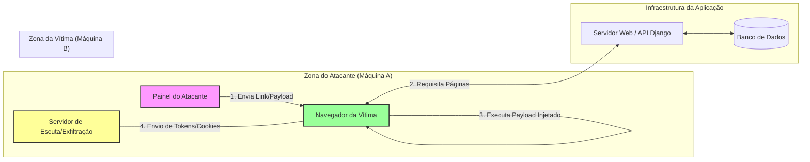
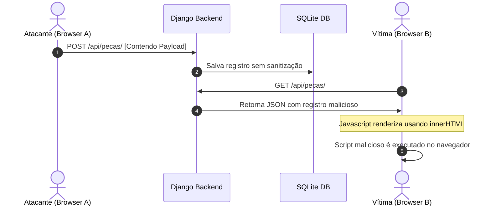

# Revisão Crítica e Arquitetural de Segurança: Vulnerabilidades XSS

Este documento apresenta uma revisão crítica de segurança do projeto **Autopeças JB**, focando nas vulnerabilidades de **Cross-Site Scripting (XSS)**. O objetivo é elevar a qualidade técnica e acadêmica do projeto, fornecendo uma análise profunda e realistas de cenários de ameaças, alinhada com as melhores práticas de desenvolvimento seguro e avaliações acadêmicas de cibersegurança.

---

## 1. Avaliação de Realismo dos Cenários Atuais

A implementação atual do projeto cumpre um papel pedagógico inicial ao expor os conceitos básicos de XSS. No entanto, sob a ótica de um ambiente real e de uma avaliação acadêmica rigorosa, existem simplificações significativas que afetam a verossimilhança dos ataques:

### Cenário A: XSS Baseado no DOM (Comentários)
* **Status de Realismo**: **Simplificado em Excesso (Self-XSS com persistência local fictícia)**
* **Crítica Técnica**: O fluxo lê os dados de uma caixa de entrada local e os armazena no `localStorage` do próprio navegador, renderizando-os em seguida usando um método inseguro do DOM. Como o `localStorage` é isolado por origem e máquina, este ataque só afeta o próprio usuário que digitou o texto. Na prática da segurança, isso é classificado como **Self-XSS** (Auto-XSS), o que possui risco nulo ou irrelevante, pois um atacante remoto não tem como forçar a gravação de dados diretamente no `localStorage` da vítima sem possuir previamente outro vetor de execução.
* **O que falta para o realismo**: O DOM-Based XSS real geralmente ocorre quando o script lê dados de uma fonte controlada pelo atacante diretamente via URL (como parâmetros de consulta, hash de rota ou referenciadores de navegação) e insere esses dados em um coletor (*sink*) vulnerável do DOM sem passar pelo servidor.

### Cenário B: XSS Refletido (Barra de Busca)
* **Status de Realismo**: **Plausível, mas operacionalmente isolado**
* **Crítica Técnica**: A leitura do parâmetro de busca diretamente da URL (`?q=`) e a sua posterior renderização na página simulam corretamente o vetor técnico de reflexão. Contudo, em um ambiente real, o ataque não se encerra na execução de uma caixa de diálogo local. O ataque real exige a construção de uma engenharia social ativa (por exemplo, envio do link malicioso) e uma ação pós-exploração (como exfiltração de dados).
* **O que falta para o realismo**: Representação do fluxo de exfiltração e separação nítida das personas (o atacante que gera o link malicioso vs. a vítima que clica nele).

### Cenário C: XSS Armazenado (Cadastro de Peças)
* **Status de Realismo**: **Plausível, com inconsistência de privilégios**
* **Crítica Técnica**: Salvar dados no banco de dados e exibi-los no catálogo de produtos simula a persistência. No entanto, o fluxo atual assume que o atacante é o administrador que cadastra as peças no Django Admin, e a vítima é o cliente que visita a loja. Em uma situação de ataque real, um atacante dificilmente terá credenciais de administração para injetar scripts no catálogo (se já as tivesse, o XSS seria desnecessário).
* **O que falta para o realismo**: O vetor de injeção armazenada deve partir de um usuário comum ou sem privilégios elevadíssimos (por exemplo, avaliações de produtos, alteração de perfil de cliente ou envio de mensagens de suporte) e ser executado por outros usuários ou, idealmente, por um administrador do sistema.

---

## 2. Contexto Operacional e Atores

Para modelar adequadamente os ataques de forma que representem situações do mundo real, é necessário mapear os atores e os fluxos de dados de acordo com a tabela abaixo:

| Cenário de XSS | Atacante (Origem) | Vítima (Destino) | Papel da Aplicação Web | Componentes Envolvidos | Necessidade de Múltiplos Usuários |
| :--- | :--- | :--- | :--- | :--- | :--- |
| **Armazenado (Stored)** | Usuário malicioso ou cliente comum que insere dados no banco de dados. | Outro cliente que visita a página ou o Administrador do sistema no painel de controle. | Armazena a carga útil no banco de dados SQLite e a serve sem sanitização nas APIs REST do Django. | Cliente (Browser Atacante), Servidor Django, Banco de Dados, Cliente (Browser Vítima). | **Sim**. Exige um ator injetando e outro executando para caracterizar o risco coletivo. |
| **Refletido (Reflected)** | Atacante externo que desenvolve um link adulterado e o envia por canais de comunicação. | Usuário legítimo que clica no link e tem sua sessão ativa aberta no navegador. | Recebe a requisição com o parâmetro malicioso e o reflete de volta no corpo da página. | Link adulterado, Navegador da Vítima, Código Javascript do Frontend. | **Sim**. O atacante e a vítima utilizam sessões distintas; a aplicação é o veículo de reflexão. |
| **Baseado no DOM** | Atacante externo que direciona a vítima para uma URL estruturada com âncoras/hashes maliciosas. | Usuário legítimo que navega até a URL adulterada. | Não precisa refletir o script no servidor; apenas fornece os arquivos HTML/JS estáticos vulneráveis. | Navegador da Vítima, Elementos DOM (`location.hash`), código JS Client-side. | **Sim**. Embora ocorra no cliente, a carga útil de ataque provém de uma fonte controlada externamente. |

---

## 3. Arquitetura do Cenário de Demonstração

Para atingir a profundidade técnica exigida em nível acadêmico, o ambiente de demonstração deve ir além de uma simulação local e estática em um único navegador. O ataque realista é, por definição, distribuído e multi-sistema.

### Limitações da Arquitetura de Dispositivo Único
Demonstrar o ataque no mesmo navegador onde o payload é escrito esconde a natureza silenciosa e perigosa do XSS. Para a banca avaliadora, pode parecer um comportamento "autoinfligido", reduzindo a gravidade percebida da ameaça.

### Arquitetura de Demonstração Recomendada (Multi-Persona)

A arquitetura ideal para validação acadêmica requer a simulação de três zonas de rede ou papéis operacionais distintos:



1. **Máquina do Atacante**: Responsável por injetar payloads armazenados ou gerar links maliciosos para ataques refletidos/DOM. Além disso, hospeda um serviço de escuta de rede para receber dados exfiltrados (por exemplo, um servidor HTTP simples que registra requisições recebidas).
2. **Servidor da Aplicação (Django/Flask)**: Centraliza as APIs e o armazenamento dos dados, servindo como o repositório ou o refletor neutro.
3. **Máquina da Vítima**: Executa um navegador onde o usuário está autenticado no sistema legítimo. Ao abrir a página vulnerável ou clicar no link nocivo, o script é executado no contexto do seu navegador, roubando suas credenciais de sessão (JWT do `localStorage` ou Cookies) e enviando-os para a máquina do atacante.

---

## 4. Análise Detalhada das Categorias de XSS

Abaixo, detalhamos o funcionamento de cada categoria de XSS, evidenciando as restrições da implementação atual e sua aplicabilidade prática em cenários reais:

### A. XSS Armazenado (Stored XSS)
* **Fluxo de Execução**: 
  1. O atacante submete uma entrada maliciosa por meio de um formulário público.
  2. O servidor persiste a entrada no banco de dados sem sanitização.
  3. A vítima acessa a funcionalidade que exibe esse registro.
  4. O servidor envia o dado malicioso na resposta HTTP.
  5. O navegador da vítima renderiza o dado em um elemento vulnerável (ex: `innerHTML`), executando o script do atacante.
* **Grau de Realismo Corporativo**: **Extremamente Alto**. Ocorre comumente em portais corporativos de chamados, seções de comentários de blogs, revisões de e-commerce e campos de perfil do usuário.
* **Limitação Atual no Projeto**: O cadastro de produtos é a única fonte de dados armazenada em banco que gera XSS. Como as permissões de cadastro de produtos costumam ser restritas, a simulação perde realismo.
* **Diagrama de Sequência (Stored XSS)**:



### B. XSS Refletido (Reflected XSS)
* **Fluxo de Execução**:
  1. O atacante monta uma URL contendo o script malicioso nos parâmetros.
  2. O atacante induz a vítima a acessar a URL criada (via e-mail, redes sociais, chat).
  3. O navegador da vítima envia a requisição para a aplicação web.
  4. A aplicação web lê o parâmetro e o inclui diretamente na página de resposta.
  5. O navegador da vítima interpreta a resposta e executa o script no contexto da sessão ativa.
* **Grau de Realismo Corporativo**: **Alto**. Frequente em mecanismos de busca antigos, páginas de erro customizadas que ecoam parâmetros inválidos e telas de filtragem.
* **Limitação Atual no Projeto**: A exibição do termo de busca no catálogo reflete a query de forma direta. Embora atenda ao critério conceitual, o projeto carece de uma interface de engenharia social ou de um fluxo claro de pós-exploração.

### C. XSS Baseado no DOM (DOM-Based XSS)
* **Fluxo de Execução**:
  1. O atacante envia à vítima uma URL maliciosa apontando para a aplicação legítima.
  2. A vítima acessa a URL e carrega a página.
  3. O script da página lê os dados diretamente da URL (ex: `window.location.hash`).
  4. O script atualiza o DOM de forma insegura (utilizando um coletor de execução como `innerHTML` ou `eval()`).
  5. O script malicioso é executado inteiramente no navegador do cliente, sem que o payload passe necessariamente pelo servidor.
* **Grau de Realismo Corporativo**: **Altíssimo** em arquiteturas modernas baseadas em Single Page Applications (SPAs) que utilizam roteadores dinâmicos do lado do cliente (React Router, Angular, Vue, etc.).
* **Limitação Atual no Projeto**: O cenário de comentários usa `localStorage` local, o que impede uma simulação em que o atacante induza a vítima a executar o script à distância.

---

## 5. Avaliação Crítica da Implementação Existente

Analisando a estrutura técnica atual do projeto, identificamos os seguintes pontos críticos:

1. **Mecanismo de Controle Local (`xss_safe_mode`)**:
   * *Crítica*: A alternância de segurança é realizada por uma variável no `localStorage` controlada pelo cliente. Na realidade do desenvolvimento seguro, políticas de segurança não são chaves locais manipuláveis pelo usuário em tempo de execução na mesma página.
   * *Justificativa Acadêmica*: Para fins didáticos de apresentação, a chave é útil. Contudo, ela deve ser devidamente explicada como um **mecanismo estritamente didático**, deixando claro que, em produção, as rotinas seguras devem ser definitivas e impostas pelo servidor e pela build do código de frontend.
2. **Ausência de Alvos com Privilégios Distintos**:
   * *Crítica*: A aplicação não diferencia de forma robusta o que um cliente comum faz em relação ao painel administrativo. Não há um "painel de administração" em HTML/JS próprio onde um administrador visualiza chamados ou avaliações enviadas por clientes. Isso enfraquece o impacto real do Stored XSS.
3. **Persistência de Dados Cliente no DOM XSS**:
   * *Crítica*: A persistência de comentários no `localStorage` induz o estudante ao erro conceitual de confundir DOM-based XSS com Stored XSS. O DOM-based XSS deve ser centrado estritamente na leitura de fontes do cliente sem persistência compartilhada.

---

## 6. Proposta de Modificações Estruturais e Arquitetura Avançada

Para elevar a qualidade acadêmica e responder ao feedback recebido, propomos as seguintes melhorias na arquitetura e nos fluxos do projeto:

### A. Reorganização de Papéis e Criação do Painel do Administrador
Em vez de focar no cadastro de peças (que exige login administrativo), deve-se implementar um cenário de **Fale Conosco / Suporte Técnico**:
1. **Perfil Cliente**: Envia uma mensagem ou chamado de suporte relatando um problema em uma peça. Este formulário é aberto a usuários não autenticados ou clientes comuns.
2. **Perfil Administrador**: Acessa uma página administrativa restrita (`/admin-dashboard.html`) para visualizar as mensagens de suporte recebidas.
3. **O Fluxo de Ataque**: O payload malicioso é inserido na mensagem de suporte (Stored XSS). Quando o administrador faz login e abre a mensagem para análise na área administrativa, o script é executado no contexto de sua sessão de administrador.

### B. Implementação do Fluxo de Exfiltração de Sessão
Para demonstrar o impacto real sobre a confidencialidade e a integridade de forma visual:
1. O script malicioso injetado deve simular a leitura do JWT ou de cookies de sessão.
2. O script faz uma requisição HTTP silenciosa (via `fetch` ou inserção dinâmica de imagens) enviando o token para o microsserviço Flask (rodando na porta `8001`), que funcionará temporariamente como o "Painel de Coleta do Atacante".
3. O microsserviço Flask exibe os tokens interceptados em um terminal ou em uma interface gráfica simples (`http://127.0.0.1:8001/attacker-panel`), provando que o atacante agora possui controle sobre a conta da vítima.

### C. Ajuste do Cenário DOM-Based
Substituir a seção de comentários do `localStorage` por um parâmetro de URL que configure o tema da aplicação ou a mensagem de boas-vindas.
* **Novo Cenário**: Um link com o hash `index.html#mensagem=[Payload]` que carrega uma rotina Javascript responsável por ler `location.hash` e atualizar um banner informativo usando `innerHTML`. Isso demonstra o DOM-Based XSS em seu estado puro e realista.

---

## 7. Enquadramento e Complexidade Acadêmica (Segurança Avançada)

Esta seção fornece o embasamento acadêmico exigido para elevar o nível do projeto em apresentações científicas e bancas de avaliação.

### A. Modelagem de Ameaças (STRIDE)
Aplicando o modelo STRIDE às interações do projeto:

* **T - Tampering (Adulteração)**: Usuários maliciosos adulteram dados enviados ao banco (Stored XSS) ou parâmetros da URL (Reflected/DOM XSS) para alterar a lógica de renderização de páginas no navegador de terceiros.
* **I - Information Disclosure (Vazamento de Informação)**: O script executado no navegador da vítima acessa informações confidenciais de sessão (JWT no `localStorage`) e as transmite para domínios de terceiros.

### B. Mapeamento de Vulnerabilidades e Riscos

* **OWASP Top 10 (2021)**: Enquadrado na categoria **A03:2021 - Injection**, que engloba vulnerabilidades onde dados fornecidos pelo usuário são interpretados como comandos ou scripts.
* **Common Weakness Enumeration (CWE)**:
  * **CWE-79**: Improper Neutralization of Input During Web Page Generation ('Cross-site Scripting').
  * **CWE-80**: Improper Neutralization of Script-Related HTML Tags in a Web Page (Basic XSS).
  * **CWE-83**: Improper Neutralization of Input During Template Generation (DOM-Based XSS).
* **MITRE ATT&CK Matrix**:
  * **Técnica T1059.007 (Command and Scripting Interpreter: JavaScript)**: Execução de código arbitrário pelo navegador sob a autoridade da sessão da vítima.
  * **Técnica T1204.001 (User Execution: Malicious Link)**: Necessidade de induzir o usuário a clicar em um link construído pelo atacante para viabilizar o XSS Refletido e DOM-Based.
  * **Técnica T1539 (Steal Web Session Cookie / Local Storage)**: Ação pós-exploração focada no roubo de credenciais de autenticação ativas.

### C. Impacto no Triângulo CIA (Confidencialidade, Integridade e Disponibilidade)

```
        [ Confidencialidade ]
                 ▲
                 │ (Alta: Roubo de Tokens de Autenticação / JWT)
                 │
                 ▼
[ Integridade ] ◄-► [ Disponibilidade ]
  (Alta: Defacing da    (Média: Redirecionamentos de Páginas
   Interface e Ações     e scripts em loop travando o navegador)
   não autorizadas)
```

* **Confidencialidade**: **Impacto Alto**. Permite a leitura de dados sensíveis na tela da vítima e a coleta de chaves de acesso (tokens) que dão acesso total à conta.
* **Integridade**: **Impacto Alto**. Permite que o atacante realize ações em nome da vítima (como alterar senhas, fazer compras ou cadastrar novos dados) e realize o *defacement* (alteração visual) da aplicação legítima.
* **Disponibilidade**: **Impacto Médio**. O script malicioso pode causar travamento do navegador da vítima por loops infinitos de execução, redirecionar o usuário para fora da plataforma ou indisponibilizar a interface de uso.

### D. Controles de Mitigação Modernos
A defesa aprofundada contra XSS exige a implementação de múltiplas camadas de controle:

1. **Validação de Entrada e Codificação de Saída (Context-Aware Output Encoding)**:
   * Garantir que as bibliotecas de renderização tratem dados dinâmicos como texto (`textContent` no Vanilla JS, ou escaping nativo no React/Angular).
2. **Content Security Policy (CSP)**:
   * Cabeçalho de segurança que define as origens permitidas para scripts. Uma diretiva forte impede a execução de scripts embutidos inline no HTML.
3. **Proteção de Tokens de Sessão (Cookies com HttpOnly)**:
   * Substituir o uso de JWT em `localStorage` (onde qualquer script Javascript tem leitura irrestrita) por Cookies de Sessão protegidos com a flag `HttpOnly`. Essa diretiva do navegador impede que scripts acessem o cookie via `document.cookie`, anulando a capacidade de roubo de sessão através do XSS.

---

## 8. Cenários Corporativos de Alto Realismo para Projetos Avançados

Caso o projeto seja estendido para simular ambientes corporativos complexos, sugerimos a modelagem de um dos seguintes cenários reais:

### Cenário 1: O Ataque à Esteira de Chamados de TI (Enterprise Helpdesk SaaS)
* **Contexto**: Um portal de atendimento ao cliente corporativo onde usuários externos abrem chamados técnicos.
* **O Ataque**: Um cliente insatisfeito ou atacante externo preenche o formulário de chamado de suporte técnico inserindo um payload no campo "Descrição do Problema".
* **O Alvo**: O analista de suporte da empresa (com privilégios elevados), que visualiza a fila de chamados no painel corporativo.
* **Mecânica Realista**: Quando o analista abre o chamado para responder, o payload é executado no painel administrativo dele. O script intercepta as credenciais administrativas do analista e realiza uma ação automática em segundo plano (como promover o usuário comum a administrador ou aprovar reembolsos financeiros).

### Cenário 2: Plataforma Colaborativa de Documentos (SaaS Multi-tenant)
* **Contexto**: Aplicação em nuvem estilo editor de texto compartilhado ou gerenciador de tarefas.
* **O Ataque**: O atacante cria um comentário em uma tarefa ou linha de documento compartilhado que contém o payload.
* **O Alvo**: Todos os colaboradores que participam do mesmo projeto e recebem notificações ou carregam a mesma tela de edição de documentos.
* **Mecânica Realista**: Ao abrirem o documento compartilhado para trabalhar, o script executa e envia solicitações de API simulando as ações das vítimas para injetar scripts em outros documentos do sistema, agindo como um "worm" de XSS auto-propagável dentro da plataforma corporativa.
